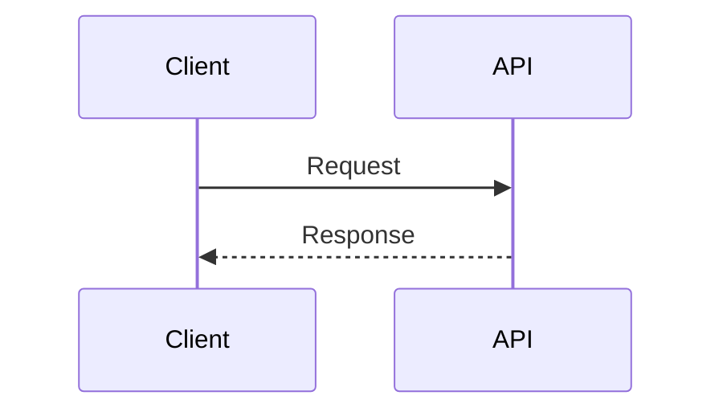

# API Specification

## Overview

| Field | Value |
|-------|-------|
| Service | [service name] |
| Base URL | [e.g., /api/v1/loans] |
| Auth | [Bearer / API key / mTLS] |
| Date | [DD-MMM-YYYY] |

## Endpoint: [METHOD] [path]

### Description
[What this endpoint does]

### Request

**Headers**

| Header | Required | Description |
|--------|----------|-------------|
| Authorization | Yes | Bearer token |

**Body**

```json
{
  "field": "type — description"
}
```

### Response

**200 OK**

```json
{
  "field": "type — description"
}
```

**Error Responses**

| Status | Code | Description |
|--------|------|-------------|
| 400 | INVALID_INPUT | [when] |
| 401 | UNAUTHORIZED | [when] |
| 404 | NOT_FOUND | [when] |
| 500 | INTERNAL_ERROR | [when] |

### Business Rules

1. [rule]
2. [rule]

### Sequence (optional)


